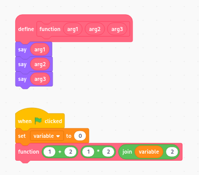

# goboscript
[goboscript](https://github.com/aspizu/goboscript) is a text-based programming language which transpiles to [Scratch](https://scratch.mit.edu).

[goboscript](goboscript) will transpile your goboscript project into a Scratch project.

[goboscript-vscode](goboscript-vscode) is a VS Code extension for syntax highlighting `.gs` files. (A pre-built .VSIX is available)

## Demo

##### File structure
```
project/
 |--assets/                 # Costumes and Sounds
 |   | blank.svg      
 |   | scratchcat.svg 
 | main.gs                  # Main sprite
 | stage.gs                 # Stage sprite
```

##### main.gs
```
costumes "assets/blank.svg";

def function arg1, arg2, arg3 {
    say @arg1;
    say @arg2;
    say @arg3;
}

onflag {
    variable = 0;
    function 1 + 2, 1 * 2, variable ++ 2;
}
```

##### transpiled to Scratch blocks


## Installation
Binary packages are not provided.

##### Clone the repository
`git clone https://github.com/aspizu/goboscript goboscript-git`.

##### Add a alias
`alias gsc='python /path/to/goboscript-git/goboscript'`.

##### Install dependencies with pip
Dependencies: `lark`, `rich`, `gobomatic`

(Note: It is recommended to install gobomatic from [source](https://github.com/aspizu/gobomatic))

## Documentation
[Documentation Would Be Here](docs/docs.md)

## Basic Usage

### Building a project
`gsc /path/to/project/folder /path/to/output.sb3`
