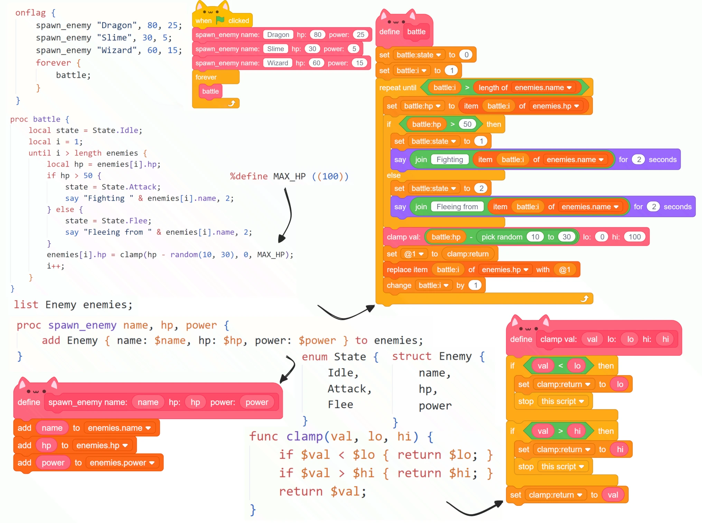
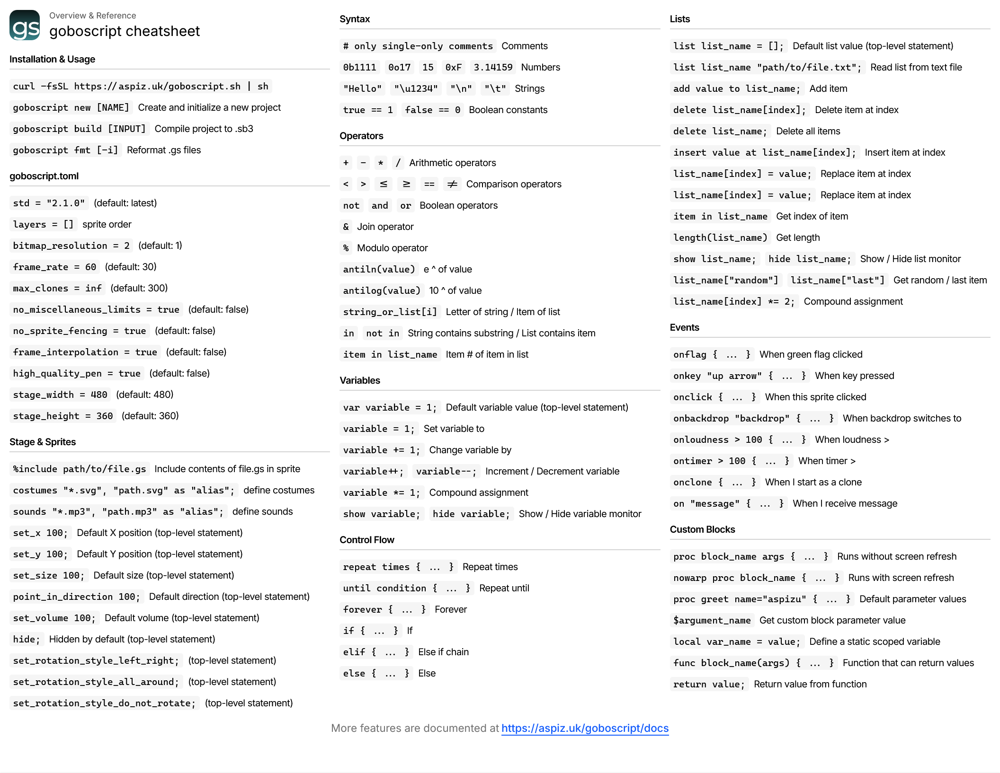

<h1 align="center">
  
  goboscript
</h1>

  <strong><a href="https://aspiz.uk/goboscript/ide">Launch IDE</a></strong>&nbsp;&nbsp;•&nbsp;
  <strong><a href="https://aspiz.uk/goboscript/docs">Documentation</a></strong>&nbsp;&nbsp;•&nbsp;
  <strong><a href="https://github.com/goboscript/std">Standard Library</a></strong>&nbsp;&nbsp;•&nbsp;
  <strong><a href="https://github.com/aspizu/backpack">Package Manager</a></strong>&nbsp;&nbsp;•&nbsp;
  <strong><a href="https://github.com/aspizu/sb2gs">Decompiler</a></strong>&nbsp;&nbsp;•&nbsp;
  <strong><a href="https://github.com/aspizu/goboscript-mcp">MCP Server</a></strong>

<picture>
  <source media="(prefers-color-scheme: dark)" srcset="docs/assets/og-image-dark.webp" />
  <source media="(prefers-color-scheme: light)" srcset="docs/assets/og-image-light.webp" />
  
</picture>

  

goboscript is a text-based programming language that compiles to Scratch. Write
Scratch projects in text, and compile it into a `.sb3` file -- which can be opened
in the Scratch editor, TurboWarp or be uploaded to the Scratch website.

goboscript makes developing advanced Scratch projects FAST. goboscript syntax is
concise and easy to read. Use a version-control system such as git. Use VS Code
or your favourite text-editor. Share code by copy-pasting. Use the standard library.
Refactor code using search and replace. Write scripts in other programming languages
to generate goboscript code. goboscript allows you to integrate external tooling and
workflows, such as using a script to generate costumes for a text rendering engine, 
or loading in images into lists. goboscript has a powerful macro system similar to C.
The standard library includes many macros for frequently used patterns, such as
converting R, G, B values into a single integer. goboscript performs optimization,
removes unused code, and detects problems & mistakes.

goboscript is more than just an 1:1 mapping of Scratch blocks to text, it has
abstractions such as:

  - Custom data-types using Structs and Enums.
  - Functions that return values
  - Default parameters for Functions & Procedures
  - Operators such as: `!=`, `>=`, `<=`, `//` (Floor division), `not in`
  - Local variables (Function-scoped)
  - and more...

All these abstractions are compiled down to regular Scratch code.

<picture>
  <source media="(prefers-color-scheme: dark)" srcset="docs/assets/cheatsheet-dark.png" />
  <source media="(prefers-color-scheme: light)" srcset="docs/assets/cheatsheet-light.png" />
  
</picture>

[**Scratch Forum topic**](https://scratch.mit.edu/discuss/topic/747370/)&nbsp;&nbsp;•&nbsp;&nbsp;[**Made With goboscript Studio**](https://scratch.mit.edu/studios/51262907/)

## Sister Projects

 - [std](https://github.com/goboscript/std): The goboscript standard library.
 - [backpack](https://github.com/aspizu/backpack): Package manager for goboscript.
 - [sb2gs](https://github.com/aspizu/sb2gs): Decompile Scratch projects (.sb3) into goboscript projects (.gs)
 - [IDE](https://github.com/aspizu/goboscript-ide): Online IDE for goboscript, runs projects instantly in the browser.
 - [MCP Server](https://github.com/aspizu/goboscript-mcp): Connects AI coding agents to the compiler and Turbowarp Desktop.

### Other Text-Based Scratch projects

For a complete list of all text-based scratch projects, see <https://scratch.mit.edu/discuss/topic/792714/>

**@retr0id** first presented the demoscene discord with his
[**boiga**](https://github.com/DavidBuchanan314/boiga) project. boiga works by
exporting Python data structures which nicely represent Scratch code in the form of
Python code. Soon after, I created my own re-implementation of boiga called Gobomatic.

## Contributing

See the [**Contributing Guide**](https://aspiz.uk/goboscript/docs/contributing.html) for
instructions on setting up the development environment and submitting Pull Requests.

## FOSS HACK 25

goboscript was one of the
[first-place winners](https://forum.fossunited.org/t/foss-hack-2025-results/5541) of
FOSS HACK 25, and was awarded a ₹50,000 prize. FOSS HACK 25 was a open-source
hackathon conducted on 22nd - 23rd February 2025 by the FOSS United Foundation.
During the 48-hour hackathon, I had worked on several goboscript issues and feature
implementation. Thank you FOSS United for the platform and opportunity.

## Star History

<a href="https://www.star-history.com/#aspizu/goboscript&Date">
 <picture>
   <source media="(prefers-color-scheme: dark)" srcset="https://api.star-history.com/svg?repos=aspizu/goboscript&type=Date&theme=dark" />
   <source media="(prefers-color-scheme: light)" srcset="https://api.star-history.com/svg?repos=aspizu/goboscript&type=Date" />
   
 </picture>
</a>
