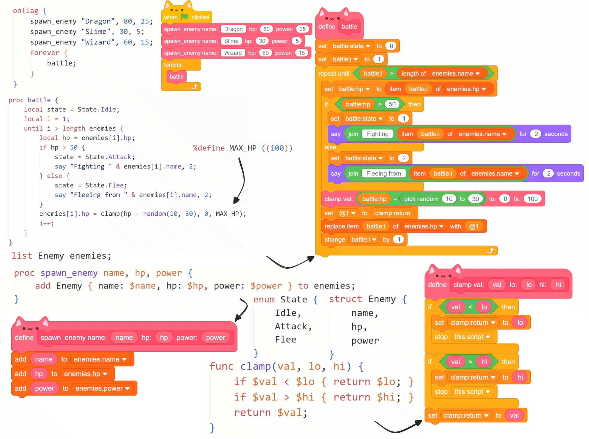
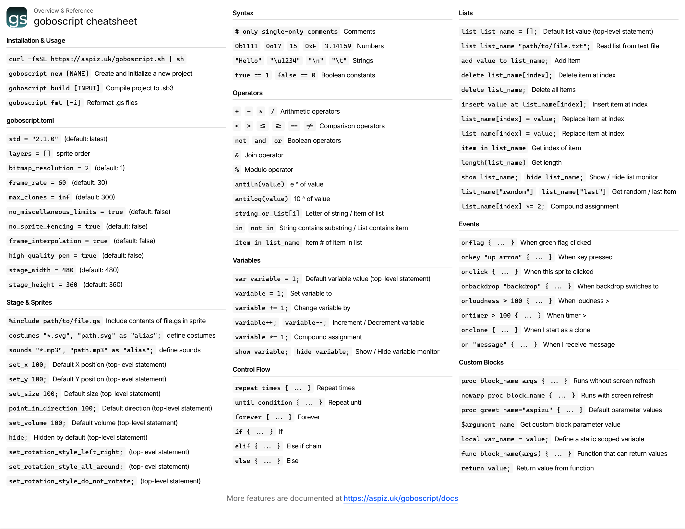

<h1 align="center">
  
  goboscript
</h1>

  <strong><a href="https://aspiz.uk/goboscript/ide">IDE</a></strong>&nbsp;&nbsp;•&nbsp;
  <strong><a href="https://aspiz.uk/goboscript/docs">Documentation</a></strong>&nbsp;&nbsp;•&nbsp;
  <strong><a href="https://github.com/aspizu/sb2gs">Decompiler</a></strong>&nbsp;&nbsp;•&nbsp;
  <strong><a href="https://github.com/goboscript/std">Standard Library</a></strong>&nbsp;&nbsp;•&nbsp;
  <strong><a href="https://github.com/aspizu/backpack">Package Manager</a></strong>

<picture>
  <source media="(prefers-color-scheme: dark)" srcset="docs/assets/og-image-dark.webp" />
  <source media="(prefers-color-scheme: light)" srcset="docs/assets/og-image-light.webp" />
  
</picture>

  

goboscript is a text-based programming language that compiles to Scratch. Write
your project as plain text and compile it into a `.sb3` file that opens in the
Scratch editor, TurboWarp, or on the Scratch website.

goboscript makes developing advanced Scratch projects fast. The syntax is concise
and easy to read, and because projects are plain text, you get the full power of
modern tooling:

- Version control with git.
- Any editor you like -- VS Code, or your favourite text editor.
- Sharing code by copy-pasting.
- Refactoring with search and replace.
- Code generation -- write scripts in other languages that emit goboscript.
- External tools and workflows, such as generating costumes for a text rendering
  engine or loading images into lists.

A powerful macro system (similar to C's) eliminates repetition, and the
[standard library](https://github.com/goboscript/std) ships macros for frequently
used patterns, like converting R, G, B values into a single integer. The compiler
optimizes your project, removes unused code, and detects problems and mistakes.

goboscript goes beyond a 1:1 mapping of Scratch blocks to text with abstractions
such as:

- Custom data types using Structs and Enums.
- Functions that return values.
- Default parameters for functions and procedures.
- Operators such as `!=`, `>=`, `<=`, `//` (floor division) and `not in`.
- Local variables (function-scoped).
- ...and more.

All of these abstractions compile down to regular Scratch code.

<picture>
  <source media="(prefers-color-scheme: dark)" srcset="docs/assets/cheatsheet-dark.png" />
  <source media="(prefers-color-scheme: light)" srcset="docs/assets/cheatsheet-light.png" />
  
</picture>

[**Scratch Forum Topic**](https://scratch.mit.edu/discuss/topic/747370/)&nbsp;&nbsp;•&nbsp;&nbsp;[**Made With Goboscript Studio**](https://scratch.mit.edu/studios/51262907/)&nbsp;&nbsp;•&nbsp;&nbsp;[**Hacker News Discussion (Reached Frontpage)**](https://news.ycombinator.com/item?id=44026799)

## Prior Art

For a complete list of text-based Scratch languages, see
<https://scratch.mit.edu/discuss/topic/792714/>.

[@retr0id](https://scratch.mit.edu/users/retr0id/) first presented his
[boiga](https://github.com/DavidBuchanan314/boiga) project to the demoscene
Discord. boiga exports Python data structures that neatly represent Scratch code
as Python source. Soon after, I created my own re-implementation of boiga called
Gobomatic.

## Contributing

See the [**Contributing Guide**](https://aspiz.uk/goboscript/docs/contributing.html)
for instructions on setting up a development environment and submitting pull
requests.

See [**CHANGELOG**](./CHANGELOG.md) for a list of changes.

## FOSS HACK 25

goboscript was one of the
[first-place winners](https://forum.fossunited.org/t/foss-hack-2025-results/5541)
of FOSS HACK 25 and was awarded a ₹50,000 prize. FOSS HACK 25 was a 48-hour
open-source hackathon conducted on 22nd – 23rd February 2025 by the FOSS United
Foundation. Over the weekend, I worked on several goboscript issues and features.
Thank you FOSS United.

## Star History

<a href="https://star-history.dera.page/#aspizu/goboscript&type=date&legend=top-left">
  <picture>
    <source media="(prefers-color-scheme: dark)" srcset="https://star-history.dera.page/svg?repos=aspizu/goboscript&type=date&theme=dark&legend=top-left" />
    <source media="(prefers-color-scheme: light)" srcset="https://star-history.dera.page/svg?repos=aspizu/goboscript&type=date&legend=top-left" />
    
  </picture>
</a>
