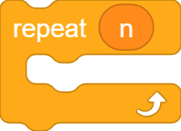
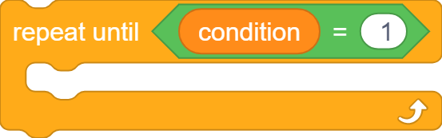
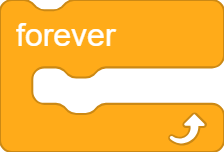
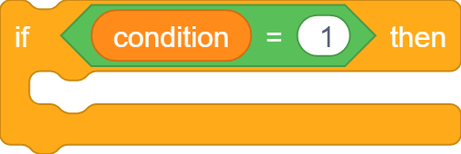
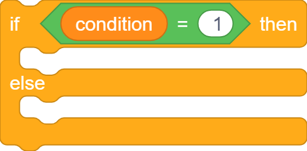
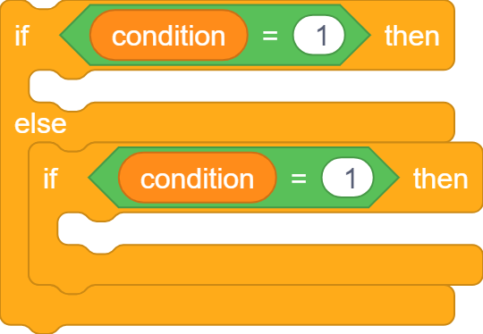

# Control Flow

## repeat n times

```goboscript
repeat n {
    # code
}
```

{width="100"}

## repeat until condition

```goboscript
until condition == true {
    # code
}
```

{width="200"}

## forever loop

```goboscript
forever {
    # code
}
```

{width="100"}

## if

```goboscript
if condition {
    # code
}
```

{width="200"}

## if else

```goboscript
if condition {
    # code
}
else {
    # code
}
```

{width="200"}

## if elif

```goboscript
if condition {
    # code
}
elif condition {
    # code
}
```

{width="200"}
