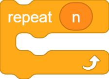
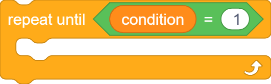
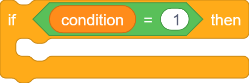
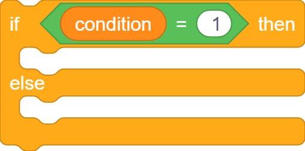
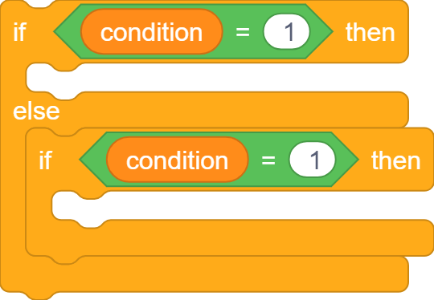

# Control Flow

## repeat n times

```goboscript
repeat n {
    # code
}
```

{width="100"}

## repeat until condition

```goboscript
until condition == true {
    # code
}
```

{width="200"}

## forever loop

```goboscript
forever {
    # code
}
```

{width="100"}

## if

```goboscript
if condition {
    # code
}
```

{width="200"}

## if else

```goboscript
if condition {
    # code
}
else {
    # code
}
```

{width="200"}

## if elif

```goboscript
if condition {
    # code
}
elif condition {
    # code
}
```

{width="200"}

## Ternary Expressions

Embed conditional logic directly inside expressions.

### Syntax

```goboscript
if (<condition>) <true_value> else <false_value>
```

### Examples

```goboscript
say if (score > 100) "winner" else "loser";
```

Ternaries can be nested — an `else` branch can itself be a ternary:

```goboscript
say if (condition_A) "A_true"
    else if (condition_B) "B_true"
    else "false";
```

When used as a condition, a ternary must be wrapped in parentheses:

```goboscript
say if (if (condition_A) true else false) "yes" else "no";
```

### Compilation

Ternaries are desugared at compile time into `if`/`else` branches. Each branch receives a copy of the surrounding statement with the ternary substituted for the appropriate value.
