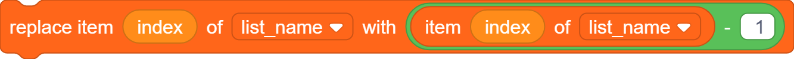
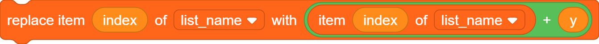
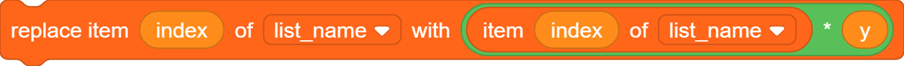
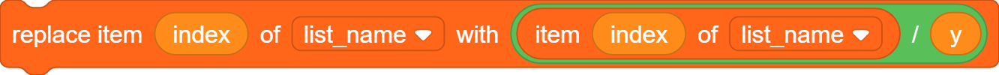
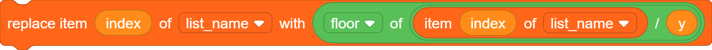
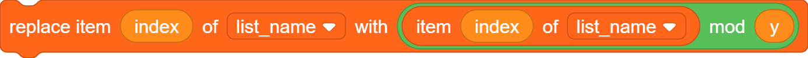
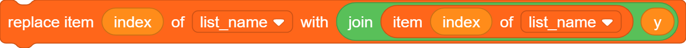

# Lists

The same rules apply for lists as for variables regarding **for all sprites** and
**for this sprite only**.

## Declaration

```goboscript
list list_name;
```

### With default values

```goboscript
list list_name = [1, 2, 3];
```

```goboscript
list type_name list_name;
```

## Operations

### Add item to list

```goboscript
add value to list_name;
```

### Delete item from list at index

```goboscript
delete list_name[index];
```

### Delete all items from list

```goboscript
delete list_name;
```

### Insert item at index in list

```goboscript
insert value at list_name[index];
```

### Replace item at index in list

```goboscript
list_name[index] = value;
```

### Get item at index in list

```goboscript
value = list_name[index];
```

### Get index of item in list

```goboscript
index = item in list_name;
```

### Get length of list

```goboscript
len = length list_name;
```

### Check if item is in list

```goboscript
if value in list_name {
    ...
}
```

### Show/Hide List Monitor

```goboscript
show list_name;
```

```goboscript
hide list_name;
```

### Get random/last item in list

```goboscript
value = list_name["random"];
```

```goboscript
value = list_name["last"];
```

## Compound Assignment

| Operator               | Implementation                                 |
|------------------------|------------------------------------------------|
| `list_name[index]++;`  | {width="400"} |
| `list_name[index]--;`  | {width="400"} |
| `list_name[index] += y;` | {width="400"} |
| `list_name[index] -= y;` | {width="400"} |
| `list_name[index] *= y;` | {width="400"} |
| `list_name[index] /= y;` | {width="400"} |
| `list_name[index] //= y;` | {width="400"} |
| `list_name[index] %= y;` | {width="400"} |
| `list_name[index] &= y;` | {width="400"} |

