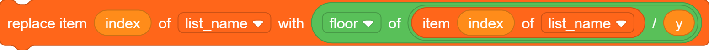

# Lists

The same rules apply for lists as for variables regarding **for all sprites** and
**for this sprite only**.

## Declaration

```goboscript
list list_name; # initialized to empty list.
```

### With default values

```goboscript
list list_name = [1, 2, 3]; # initialized with some default values.
```

```goboscript
struct point {x, y}
list point points; # empty list of points.
list point points = [100, 200, 300, 400]; # points[1] == point {x: 100, y: 200} and so on...
```

### Read contents from a text file

This allows you to load a text file line-by-line into a list of strings.

```goboscript
list list_name "filepath.txt";
list type_name list_name "filepath.txt";
```

If type is specified, each list item is made-up by N lines where N is the no. of fields in type.

## Operations

### Add item to list

```goboscript
add value to list_name;
```

### Delete item from list at index

```goboscript
delete list_name[index];
```

### Delete all items from list

```goboscript
delete list_name;
```

### Insert item at index in list

```goboscript
insert value at list_name[index];
```

### Replace item at index in list

```goboscript
list_name[index] = value;
```

### Get item at index in list

```goboscript
value = list_name[index];
```

### Get index of item in list

```goboscript
index = item in list_name;
```

### Get length of list

```goboscript
len = length list_name;
```

### Check if item is in list

```goboscript
if value in list_name {
    ...
}
```

### Show/Hide List Monitor

```goboscript
show list_name;
```

```goboscript
hide list_name;
```

### Get random/last item in list

```goboscript
value = list_name["random"];
```

```goboscript
value = list_name["last"];
```

## Compound Assignment

| Operator               | Implementation                                 |
|------------------------|------------------------------------------------|
| `list_name[index]++;`  | {width="400"} |
| `list_name[index]--;`  | {width="400"} |
| `list_name[index] += y;` | {width="400"} |
| `list_name[index] -= y;` | {width="400"} |
| `list_name[index] *= y;` | {width="400"} |
| `list_name[index] /= y;` | {width="400"} |
| `list_name[index] //= y;` | {width="400"} |
| `list_name[index] %= y;` | {width="400"} |
| `list_name[index] &= y;` | {width="400"} |

