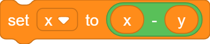
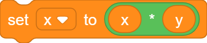
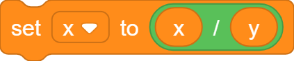
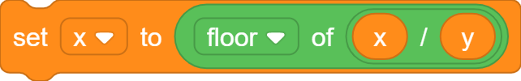
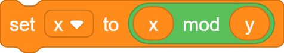
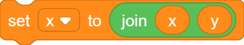

# Variables

## Declaration/Assignment

There are two ways to declare a variable:

### 1. Declare using a top-level `var` statement.

```goboscript
var variable_name = const_expr;
```

### 2. Declare by assigning a value to the variable.

The first assignment to a variable is considered its declaration.

```goboscript
variable_name = value;
```

```goboscript
type_name variable_name = value;
```

### Variables for all sprites

If a variable is assigned to in `stage.gs`, it will be declared as **for all sprites**.

### Variables for this sprite only

Variables are by-default declared as **for this sprite only**. If you want to declare a
variable **for all sprites**, assign to it in `stage.gs`.

## Local Variables

Local variables are accessible only within the procedure they are declared in.

The first assignment with the `local` keyword will declare a local variable, all further
uses of the variable will refer to the local variable. If a normal variable with the same
name exists, it will be shadowed.

```goboscript
proc my_procedure {
    local x = 0;
    x = x + 1;
}
```

In the compiled Scratch project, the variable `x` will be named as `my_procedure:x`.

!!! note
    Local variables will have undefined behavior if the procedure is recursive, or
    is NOT a run-without-screen-refresh procedure.

## Compound Assignment

| Operator   | Implementation                                       |
|------------|------------------------------------------------------|
| `x++;`     | {width="150"}            |
| `x--;`     | {width="150"}            |
| `x += y;`  | {width="150"}           |
| `x -= y;`  | {width="150"}      |
| `x *= y;`  | {width="150"}      |
| `x /= y;`  | {width="150"}        |
| `x //= y;` | {width="150"}  |
| `x %= y;`  | {width="150"}           |
| `x &= y;`  | {width="150"}          |

## Show/Hide Variable Monitor

```goboscript
show variable_name;
```

```goboscript
hide variable_name;
```
